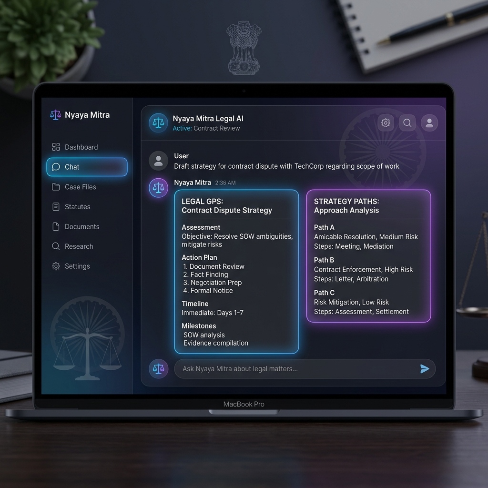

# Nyaya Mitra ⚖️ — Your Friendly Indian Criminal Law Assistant

<div align="center">
  
</div>

> **Turn messy situations into clear legal steps.** 
> **100% Free · Open Source · Bring Your Own Key**

Welcome to **Nyaya Mitra**! 👋 

Nyaya Mitra isn't just another generic AI chatbot. It is a specialized **Case Intelligence Assistant** built to help you understand India's new criminal laws: the **Bharatiya Nyaya Sanhita (BNS)**, **Bharatiya Nagarik Suraksha Sanhita (BNSS)**, and **Bharatiya Sakshya Adhiniyam (BSA)**.

Instead of expecting you to know legal jargon, Nyaya Mitra lets you tell your story naturally and translates it into a clear, actionable legal strategy.

---

## 🎯 Why Nyaya Mitra is Special

Most legal tools act like search engines and expect you to know what to ask. We do things differently:

1. **Tell Your Story:** Just type what happened in plain English. No need to cite laws!
2. **Instant Legal Mapping:** It instantly connects your story to the correct BNS/BNSS sections.
3. **Spot Weaknesses:** It acts like a critical friend, telling you where your case might be weak (like missing evidence or documents).
4. **Clear Strategy Paths:** It gives you 2-4 clear options on what to do next (like "File a Police Complaint" vs. "Settle Out of Court"), along with the pros and cons of each.
5. **Lawyer Brief:** It creates a neat summary of your situation that you can hand straight to a human lawyer to save time and money!

---

## ✅ What Nyaya Mitra Can (and Cannot) Do

**What it DOES do:** It helps you understand Indian **criminal law** based strictly on the official rulebooks (BNS/BNSS/BSA).

**What it DOES NOT do:** It cannot help with civil law, taxes, corporate issues, property disputes, or family matters (like divorce). 

*Note: If you ask about something outside of criminal law, Nyaya Mitra will politely tell you it can't help, rather than making up an answer.*

---

## 🏗️ How It Works (For the Tech Curious)

<div align="center">
  
</div>

We built this project to be **100% Free** to run and host forever!

```
You (The User)
└── 🌐 Beautiful Website (Next.js)  ───────→ Fast Python Backend ──→ Google AI (Gemini)
    (Hosted for free on Vercel)              (Hosted for free on Render)    (Using your own API key)
```

### Why does it cost nothing to host?
- **Backend (Brain):** Runs on Render's free tier because it doesn't store any data (it is "stateless").
- **Website (Face):** Runs on Vercel's free tier.
- **AI Cost:** We use a "Bring Your Own Key" (BYOK) model. You plug in your own free Google Gemini API key to use it.
- **Database:** We use local, free memory techniques (BM25) instead of expensive cloud databases.

---

## 🔒 Your Privacy & Security

Your privacy is our top priority:
- **No Data Saved:** We do not save your chats, your personal stories, or your API keys anywhere on our servers.
- **Safe Key Storage:** Your Google API key is stored only in your browser tab (`sessionStorage`). The moment you close the tab, the key disappears.
- **Strict Security:** The website is locked down against common internet attacks (like XSS or prompt injections).

---

## 🚀 Want to run it on your own computer?

It's super easy to get Nyaya Mitra running on your laptop. You don't even need complex tools like C++ compilers!

### 1. Download the Code
```bash
git clone https://github.com/Shivanshmishra7275/nyaya-mitra-mvp.git
cd nyaya-mitra-mvp
```

### 2. Start the Backend (The Brain)
You just need Python (version 3.10 to 3.13) installed on your computer.

```bash
# Create a safe space for Python (Virtual Environment)
python -m venv venv

# Activate it (Windows)
venv\Scripts\activate
# Activate it (Mac/Linux)
# source venv/bin/activate

# Install the required packages
pip install -r requirements.txt

# Teach the AI the new Indian Laws (Ingest the PDFs)
python etl_pipeline.py

# Turn on the server!
uvicorn app.main:app --host 0.0.0.0 --port 8000 --reload
```
Awesome! The brain is now running at: **http://localhost:8000**

### 3. Start the Website (The Face)
Open a *new* terminal window and run:

```bash
cd next-webapp

# Install the website packages
npm install

# Turn on the website!
npm run dev
```
Boom! 🎉 Open your browser and go to **http://localhost:3000** to see the beautiful interface.

---

## 🛰️ How to Put It on the Internet (For Free!)

Want to share this with the world? Here is how to deploy it at zero cost:

### 1. Host the Website (Vercel)
1. Push this code to your own GitHub account.
2. Go to [Vercel.com](https://vercel.com/) and import your repository.
3. Set the "Root Directory" to `next-webapp`.
4. Click Deploy!

### 2. Host the Backend (Render)
1. Go to [Render.com](https://render.com/) and create a new "Web Service".
2. Connect your GitHub repository (leave Root Directory blank).
3. Build command: `pip install -r requirements.txt`
4. Start command: `uvicorn app.main:app --host 0.0.0.0 --port 8000`
5. Add these Environment Variables so the backend knows to trust your website:
    - `APP_ENV=production`
    - `ALLOWED_ORIGINS=https://your-vercel-website-url.vercel.app`

---

## ⚠️ Important Legal Disclaimer

Nyaya Mitra is a smart helper, **not a human lawyer**. It provides legal intelligence and structured case analysis to help you understand your situation before you meet a professional. It is **not legal advice**. Please always consult a real, qualified lawyer for your specific legal issues.

---

## 📄 License

This project is licensed under the MIT License — which means it is free to use, modify, share, and deploy!

---

*Built with ❤️ to make understanding Indian legal strategy accessible to everyone.*
